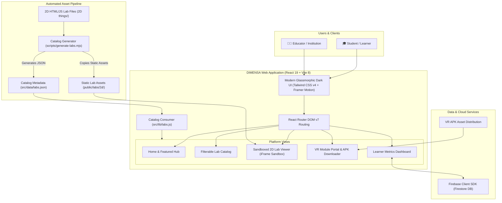

# DIMENSA

### Unified Virtual Laboratory & Interactive Learning Platform

> **Learn. Experiment. Visualize. Understand.**

DIMENSA is an open-access, web-first virtual laboratory platform built to make engineering, computer science, and practical technical education immersive, safe, scalable, and cost-effective. By combining **88+ interactive 2D simulations**, **standalone VR lab experiences**, and **dynamic algorithm visualizers**, DIMENSA bridges the gap between static textbook theory and hands-on laboratory experimentation.

---

[](https://react.dev/)
[](https://vitejs.dev/)
[](https://tailwindcss.com/)
[](https://www.framer.com/motion/)
[](https://firebase.google.com/)
[](#-browser-based--standalone-vr-labs)
[](https://github.com/Mahishukla1207/DIMENSA)

---

## 📌 Table of Contents

- [Overview](#-overview)
- [Why DIMENSA?](#-why-dimensa)
- [Core Features](#-core-features)
  - [2D Virtual Laboratories (88+ Experiments)](#-2d-virtual-laboratories-88-experiments)
  - [Browser-Based & Standalone VR Labs](#-browser-based--standalone-vr-labs)
  - [Algorithm, ML & Security Visualizers](#-algorithm-ml--security-visualizers)
  - [Learner & Institution Dashboard](#-learner--institution-dashboard)
- [Screenshots & Demo](#-screenshots--demo)
- [System Architecture](#-system-architecture)
- [How It Works](#-how-it-works)
- [Technology Stack](#-technology-stack)
- [Project Structure](#-project-structure)
- [Getting Started](#-getting-started)
- [Backend & Data Services](#-backend--data-services)
- [Current Status & Roadmap](#-current-status--roadmap)
- [Feasibility & Impact](#-feasibility--impact)
- [Team](#-team)
- [License & Contributions](#-license--contributions)

---

## 📖 Overview

Physical laboratories face high operational expenses, dangerous experimentation risks, limited equipment access, and rigid scheduling constraints. Many students only experience laboratory concepts through abstract textbook equations.

**DIMENSA solves this by delivering a unified, browser-accessible virtual lab suite** that allows students and educators to:
- Conduct step-by-step experiments with real-time feedback.
- Step through complex data structures, algorithms, cryptographic ciphers, and neural networks visually.
- Download and run standalone 3D/VR laboratory applications on VR headsets and Android devices.
- Access educational experiments anywhere, anytime, without high-end dedicated hardware.

---

## ⚖️ Why DIMENSA?

| Challenge in Traditional Labs | DIMENSA Solution |
| :--- | :--- |
| **High Equipment & Maintenance Costs** | Zero recurring hardware overhead; digital labs run directly in modern browsers. |
| **Restricted Access & Capacity Limits** | Available 24/7 with unlimited concurrent student access. |
| **Safety & Risk Constraints** | Risk-free virtual environment for electrical, network, and high-complexity simulations. |
| **Fixed Scheduling & Limited Time** | Flexible self-paced learning; repeat experiments as many times as needed. |
| **Abstract Theoretical Concepts** | Interactive visual step-by-step simulations with instant parameter changes. |
| **Geographic & Infrastructure Barriers** | Lightweight web-based deployment compatible across consumer laptops, desktops, and mobile devices. |

---

## 🚀 Core Features

### 🧪 2D Virtual Laboratories (88+ Experiments)

DIMENSA features an automated metadata-driven catalog with **88+ ready-to-launch interactive 2D simulations** organized across 7 foundational disciplines:

```
├── 🤖 Artificial Intelligence & Machine Learning (12 Experiments)
├── 🔗 Blockchain Technology (20 Experiments)
├── 🔐 Cyber Security & Cryptography (10 Experiments)
├── 🌲 Data Structures & Algorithms (25 Experiments)
├── 📐 Design & Analysis of Algorithms (11 Experiments)
├── ⚡ Basic Electrical & Electronics Engineering (10 Experiments)
└── 📊 Data Analytics & Workflow Modeling (10 Experiments)
```

#### Detailed Subject Highlights:
- **Artificial Intelligence & Machine Learning (12 Labs)**:
  Interactive simulations for NumPy & pandas manipulation, Exploratory Data Analysis (EDA), Data Preprocessing, Linear Regression, Logistic Regression, Decision Trees & Random Forests, Support Vector Machines (SVM), K-Means Clustering, Principal Component Analysis (PCA), CNN Convolution kernels, Model Evaluation Metrics, and GridSearch hyperparameter tuning.
- **Blockchain Technology (20 Labs)**:
  Hands-on simulations covering cryptographic hashing, Proof of Work (PoW) mining, blockchain tamper-proofing & validation, transaction lifecycles, smart contract execution, consensus mechanisms, sharding & scalability, Zero-Knowledge Proofs (ZKP), cross-chain interoperability, decentralized governance, token economics, and Layer 2 rollups.
- **Cyber Security & Cryptography (10 Labs)**:
  Step-by-step cryptanalysis tools for Caesar cipher (encryption/decryption), Vigenère cipher, Playfair grid construction, Monoalphabetic substitution, XOR stream ciphers, SHA-256 cryptographic hashing simulator, Diffie-Hellman key exchange visualization, and frequency distribution analysis.
- **Data Structures & Algorithms (25 Labs)**:
  Visual simulations for Sorting (Bubble, Quick, Merge, Heap, Insertion, Selection, Counting Sort), Searching (Linear, Binary Search), Graph Traversal (BFS, DFS), Shortest Path (Dijkstra, Floyd-Warshall), Minimum Spanning Trees (Prim's & Kruskal's), Linear & Circular Queues, Deques, Priority Queues, Stacks (Array & Linked List implementations), Polynomial arithmetic, and Tower of Hanoi.
- **Design & Analysis of Algorithms (11 Labs)**:
  Algorithmic paradigms in action including Recursive divide-and-conquer, Non-comparison sorting, Shell sort, Greedy algorithms, Dynamic Programming, and Backtracking problem solvers.
- **Basic Electrical & Electronics Lab (10 Labs)**:
  Hands-on circuit diagrams, electronic component measurement simulations, and structured procedure walkthroughs.
- **Data Analytics (10 Labs)**:
  Structured virtual analytics environments with dataset workflows and empirical observation procedures.

---

### 🌐 Browser-Based & Standalone VR Labs

- **`CarSimulation.apk` (Engineering Simulation)**:
  Dedicated VR laboratory application (62 MB Android APK) enabling immersive 3D spatial navigation, vehicular mechanics, and virtual physical environments.
- **Integrated VR Portal**:
  Includes in-app hardware installation guidance, APK delivery mechanism, and structured learning objectives.
- **WebXR Roadmap**:
  Planned integration for zero-install, in-browser WebXR and Three.js 3D virtual spaces directly in the browser viewport.

---

### 🧠 Algorithm, ML & Security Visualizers

Instead of reading static code or mathematical formulas, students can:
- Adjust simulation variables and input matrices dynamically.
- Observe step-by-step execution states (e.g., pivot partitioning in QuickSort, cipher transformations in Diffie-Hellman, or boundary shifts in SVM).
- Launch experiments in a sandboxed, embedded iframe viewer or pop out into a dedicated distraction-free browser window.

---

### 📊 Learner & Institution Dashboard

- **Active Metric Cards**: Track total available lab modules, 2D simulations, VR experiences, and multi-disciplinary subject coverage.
- **Quick-Resume Workspace**: Quick-access shortcuts to recently opened and featured laboratory modules.
- **Planned Institution Suite**: Educator assignment creator, student progress telemetry, automated quiz evaluation, and cohort performance analytics.

---

## 📸 Screenshots & Demo

> *Interface screenshots, interactive recordings, and video walkthroughs are actively being curated as UI modules are updated.*

```
┌────────────────────────────────────────────────────────────────────────┐
│                          DIMENSA Web Platform                          │
│                                                                        │
│  [ Discover Interactive Labs ]       [ Explore VR & 2D Modules ]       │
│                                                                        │
│  ┌──────────────────────┐  ┌──────────────────────┐  ┌──────────────┐  │
│  │ 🤖 AI / ML Labs      │  │ 🌲 DSA Visualizers   │  │ 🥽 VR Labs   │  │
│  │ 12 Live Simulations  │  │ 25 Interactive Exp.  │  │ APK Download │  │
│  └──────────────────────┘  └──────────────────────┘  └──────────────┘  │
└────────────────────────────────────────────────────────────────────────┘
```

---

## 🏗️ System Architecture



---

## 🔄 How It Works

```
┌─────────────────┐       ┌─────────────────┐       ┌─────────────────┐       ┌─────────────────┐
│  1. Discover    │  ──>  │   2. Select     │  ──>  │  3. Experiment  │  ──>  │   4. Master     │
│ Search & filter │       │ Choose 2D HTML  │       │ Tweak variables,│       │ Review metrics, │
│ by category or  │       │ simulation or   │       │ step through    │       │ track progress  │
│ lab modality    │       │ VR APK package  │       │ algorithms live │       │ on dashboard    │
└─────────────────┘       └─────────────────┘       └─────────────────┘       └─────────────────┘
```

1. **Discover**: Browse the unified catalog using multi-filter tags (Category: Computer Science, Engineering; Type: 2D, VR; Search queries).
2. **Select**: Choose an individual experiment module or VR lab package.
3. **Experiment**: Run simulations directly inside the responsive web sandbox with immediate visual and mathematical output.
4. **Master**: Inspect conceptual procedure documents, test multiple boundary scenarios, and monitor completed laboratory modules.

---

## 🛠️ Technology Stack

| Layer | Technologies | Purpose |
| :--- | :--- | :--- |
| **Frontend Framework** | **React 19.2**, **React DOM 19** | Component-driven, declarative user interface |
| **Build & Tooling** | **Vite 8.1**, **Node.js (ESM)** | Ultra-fast Hot Module Replacement (HMR) and optimized bundler |
| **Styling & Design** | **Tailwind CSS v4.3**, **Lucide Icons** | Responsive dark-mode styling, glassmorphism, and iconography |
| **Animations** | **Framer Motion 12.4** | Fluid micro-interactions and smooth page transitions |
| **Routing** | **React Router DOM v7.18** | Client-side routing with deep-linkable experiment parameters |
| **Simulations Engine** | **HTML5 Canvas, Vanilla JS, CSS3** | Self-contained, lightweight 2D interactive lab modules |
| **VR Engineering** | **Android APK Package** | Immersive 3D vehicle simulation for VR-capable devices |
| **Data & Cloud** | **Firebase Firestore SDK (v12.16)** | Real-time cloud database configuration for user & lab state |
| **Asset Pipeline** | **Node.js Script (`scripts/generate-labs.mjs`)** | Dynamic scanning and static catalog build automation |

---

## 📁 Project Structure

```
DIMENSA/
├── 2D things/                      # Source directory containing 2D HTML/JS lab simulations
│   └── 2D things/                  # Subject directories (AI-ML, DSA, Blockchain, Crypto, BEE, etc.)
├── public/                         # Public static web assets
│   ├── favicon.svg                 # Platform icon
│   ├── icons.svg                   # SVG icon definitions
│   └── labs/                       # Built static lab directory (auto-synced via generator script)
│       └── 2d/                     # Synchronized 2D lab assets accessible to the browser iframe
├── scripts/                        # Build & catalog automation scripts
│   └── generate-labs.mjs           # Node script scanning lab folders and outputting labs.json
├── src/                            # Main React application source code
│   ├── assets/                     # UI graphics and static icons
│   ├── components/                 # Reusable UI components
│   │   ├── LabCard.jsx             # Card component with dynamic badges and launcher
│   │   └── Navbar.jsx              # Responsive navigation bar with glassmorphic styling
│   ├── data/                       # Generated data files
│   │   └── labs.json               # Auto-generated catalog mapping subjects & experiments
│   ├── lib/                        # Core utilities and services
│   │   ├── firebase.js             # Firebase Firestore initialization
│   │   └── labs.js                 # Catalog retrieval and path formatting helpers
│   ├── pages/                      # Platform route pages
│   │   ├── DashboardPage.jsx       # Learner dashboard with key statistics
│   │   ├── HomePage.jsx            # Landing page with hero section & featured modules
│   │   ├── LabDetailPage.jsx       # Subject overview listing all sub-experiments
│   │   ├── LabViewerPage.jsx       # Embedded simulation sandbox with full-screen viewer
│   │   ├── LabsPage.jsx            # Filterable and searchable laboratory catalog
│   │   └── VRLabPage.jsx           # VR experience detail, objectives & APK download page
│   ├── App.css                     # Global custom styles
│   ├── App.jsx                     # Route definitions & layout wrapper
│   ├── index.css                   # Tailwind CSS import & base theme overrides
│   └── main.jsx                    # Application entry point
├── VR Labs/                        # VR application deliverables
│   └── CarSimulation.apk           # 62MB Android VR simulation package
├── eslint.config.js                # ESLint code standard rules
├── index.html                      # HTML5 root template
├── package.json                    # Project dependencies, scripts & metadata
└── vite.config.js                  # Vite bundler configuration with Tailwind plugin
```

---

## ⚡ Getting Started

### Prerequisites

Ensure you have the following installed on your machine:
- **Node.js**: `v18.0.0` or higher
- **npm**: `v9.0.0` or higher (or `pnpm` / `yarn`)
- A modern web browser (Chrome, Edge, Firefox, Brave, Safari)

### Installation

1. **Clone the repository**:
   ```bash
   git clone https://github.com/Mahishukla1207/DIMENSA.git
   cd DIMENSA
   ```

2. **Install project dependencies**:
   ```bash
   npm install
   ```

3. **Configure Environment Variables (Optional)**:
   DIMENSA includes fallback development configurations for Firebase. If you are connecting your own Firebase instance, create a `.env` file in the root directory:
   ```env
   VITE_FIREBASE_API_KEY="your-api-key"
   VITE_FIREBASE_AUTH_DOMAIN="your-project.firebaseapp.com"
   VITE_FIREBASE_PROJECT_ID="your-project-id"
   VITE_FIREBASE_STORAGE_BUCKET="your-project.appspot.com"
   VITE_FIREBASE_MESSAGING_SENDER_ID="your-sender-id"
   VITE_FIREBASE_APP_ID="your-app-id"
   ```

4. **Start the local development server**:
   ```bash
   npm run dev
   ```
   > *Note: `npm run dev` automatically triggers `npm run generate-labs` as a pre-dev hook to scan, compile, and sync all lab experiments to `src/data/labs.json` and `public/labs/2d/`.*

5. Open your browser and navigate to:
   ```
   http://localhost:5173
   ```

6. **Build for production**:
   ```bash
   npm run build
   ```
   To test the production build locally:
   ```bash
   npm run preview
   ```

---

## ☁️ Backend & Data Services

### Current Architecture
- **Catalog Generator (`scripts/generate-labs.mjs`)**: Inspects experiment directories, parses `<title>` metadata, builds unified JSON catalog files, and links assets to the public distribution.
- **Firebase Firestore Integration (`src/lib/firebase.js`)**: Configured client for cloud document persistence and future user progress tracking.

### Planned Institution REST Endpoints (Roadmap)
```
POST /api/v1/auth/login             -> Educator & Student multi-role authentication
GET  /api/v1/labs                   -> Dynamic server-side lab catalog retrieval
POST /api/v1/labs/:id/progress      -> Record student experiment telemetry & completion
POST /api/v1/assignments/assign     -> Create class-specific virtual lab assignments
GET  /api/v1/analytics/cohort       -> Institution-level student performance analytics
```

---

## 📊 Current Status & Roadmap

### Current Status

| Area | Status | Description |
| :--- | :---: | :--- |
| **2D Lab Catalog Engine** | ✅ **Live** | 88+ interactive 2D simulations across 7 disciplines fully functional. |
| **Catalog Build Pipeline** | ✅ **Live** | Automatic scanning and indexing script syncing simulations. |
| **Interactive Sandbox** | ✅ **Live** | Embedded viewer supporting in-app interaction and external tab launch. |
| **VR Application Delivery** | ✅ **Live** | Android APK distribution with hardware guides and learning objectives. |
| **Learner Dashboard** | ✅ **Live** | Real-time statistics, subject metrics, and quick-access cards. |
| **Filterable Catalog** | ✅ **Live** | Real-time search, category filtering, and modality tags. |
| **WebXR Browser VR** | 🚧 **In Development** | Three.js / WebXR native in-browser 3D laboratory experiences. |
| **User Progress Tracking** | 🚧 **In Development** | Firebase Firestore persistence for experiment history. |
| **Institution Suite** | 🔮 **Planned** | Multi-tenant school/university dashboards and automated evaluation. |

### Roadmap

- [x] Core web platform architecture with React 19, Vite, and Tailwind CSS
- [x] Dynamic catalog generation pipeline for instant module indexing
- [x] 88+ interactive 2D laboratory modules (AI/ML, DSA, Blockchain, Crypto, BEE, Analytics)
- [x] Responsive fullscreen simulation sandbox viewer
- [x] Standalone VR engineering APK distribution pipeline
- [x] Search, category filtering, and aggregate analytics dashboard
- [ ] Native in-browser WebXR / Three.js 3D virtual laboratory spaces
- [ ] User authentication and cloud experiment state synchronization
- [ ] Educator assignment portal with deadline and progress tracking
- [ ] Automated code grading and algorithmic complexity benchmarking
- [ ] AI-powered laboratory assistant for real-time concept hints

---

## 🎯 Feasibility & Impact

DIMENSA democratizes technical laboratory education by addressing systemic infrastructure challenges:

1. **Educational Equity**: Students in resource-constrained schools and colleges access the same state-of-the-art laboratory simulations as top-tier universities.
2. **Economic Viability**: Eliminates thousands of dollars in recurring physical equipment purchases, repairs, and physical space upkeep.
3. **Safety First**: Eliminates hazards in electrical circuitry, experimental networking, and hardware testing.
4. **Pedagogical Effectiveness**: Interactive visualization boosts retention far beyond passive video lectures or printed diagrams.

---

## 👥 Team

Built with passion by **Team DIMENSA**:

- **[Mahi Shukla](https://github.com/Mahishukla1207)**
- **Kush Kumar Bairwa**
- **Divyansh Mishra**
- **Dev Pratap Singh**

---

## 📜 License & Contributions

Contributions, feature suggestions, and educational institution feedback are welcome. Feel free to open an issue or submit a pull request on the [DIMENSA GitHub Repository](https://github.com/Mahishukla1207/DIMENSA).

---

<p align="center">
  <strong>DIMENSA — Learn. Experiment. Visualize. Understand.</strong><br>
  <sub>Built with ❤️ by Team DIMENSA</sub>
</p>
